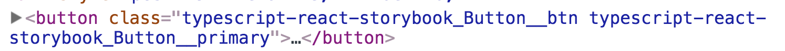

# TypeScript React Storybook

A starter kit for building a reusable component library with [TypeScript](http://www.typescriptlang.org/), [React](https://reactjs.org/), and [Storybook](https://storybook.js.org/).

## Quick Start

To get `Storybook` up and running with the provided example components:

```bash
$ yarn install
$ yarn storybook
```
Go to `localhost:6000` in your browser.  You can start building your own components and stories.

## CSS Configuration

The project is configured to use [`PostCSS`](https://github.com/postcss/postcss) and the following plugins:

 - [PreCSS](https://github.com/jonathantneal/precss)
 - [PostCSS Import](https://github.com/postcss/postcss-import)
 - [Autoprefixer](https://github.com/postcss/autoprefixer)
 - [PostCSS Mixins](https://github.com/postcss/postcss-mixins)

You can update the plugins by editing `postcss.config.js`.

The project uses the [`BEM`](http://getbem.com/naming/) naming convention for CSS classes in order to avoid CSS namespace collisions.  By default classes will use the package name defined in `package.json`:



You can customize the naming convention by editing the `localIdentName` field in `webpack.config.js` and `.storybook/webpack.config.js`:
```javascript
  MiniCssExtractPlugin.loader,
  {
    loader: require.resolve('typings-for-css-modules-loader'),
    options: {
      . . .
      localIdentName: `${packageName}_[name]__[local]`
    }
  },
```

[Nunito](https://fonts.google.com/specimen/Nunito) and [Source Code Pro](https://fonts.google.com/specimen/Source+Code+Pro) fonts are used by the provided example components.  You can customize the fonts included in the library by updating `src/styles/imports/font-face.css`


## Build

To build the library for publishing or local testing, simply run:
```bash
$ yarn build
```

After building the library, you can test it in a local project by using [`yarn link`](https://yarnpkg.com/lang/en/docs/cli/link/), or publish it directly to `npm`.

All of the fonts, styles, and images will be included in the bundled build. Just import the stylesheet:
```javascript
// Inside your top-level component
import 'typescript-react-storybook/dist/style.css';
```
and then import and use the components as normal:

```javascript
import { Button } from 'typescript-react-storybook';

const myComponent = () =>
	<div>
		<Button text="hello" onClick={() => console.log('clicked'))} />
	</div>

```

